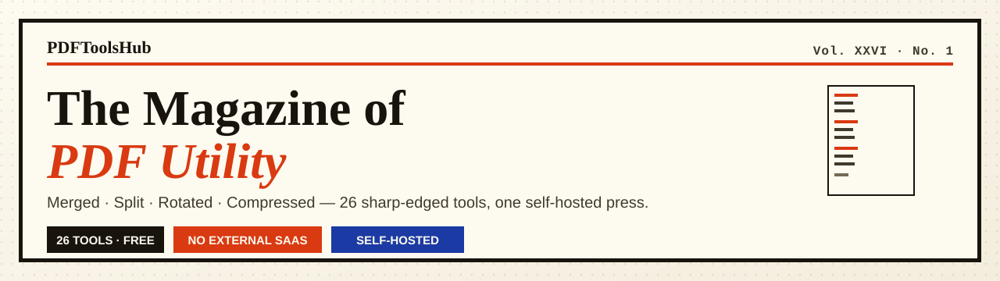
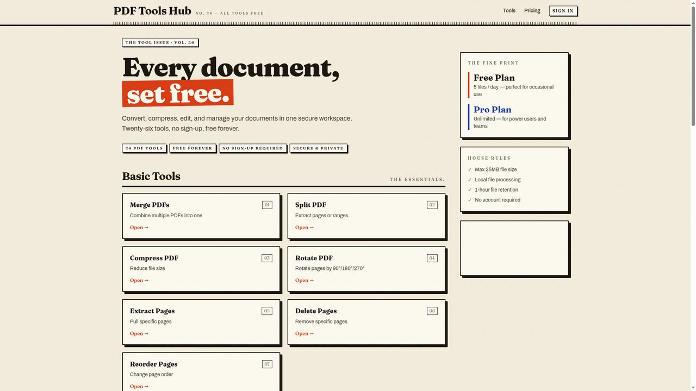
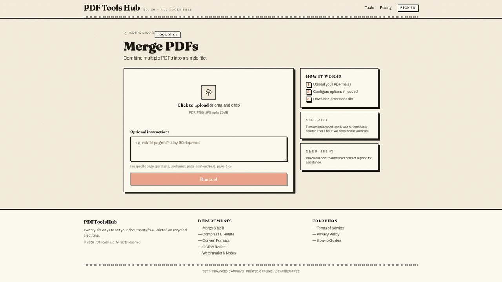
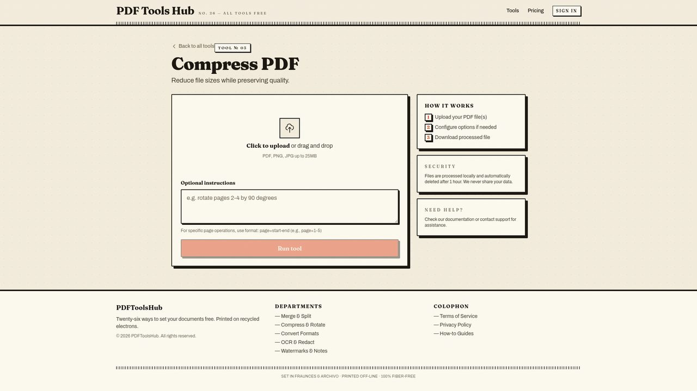
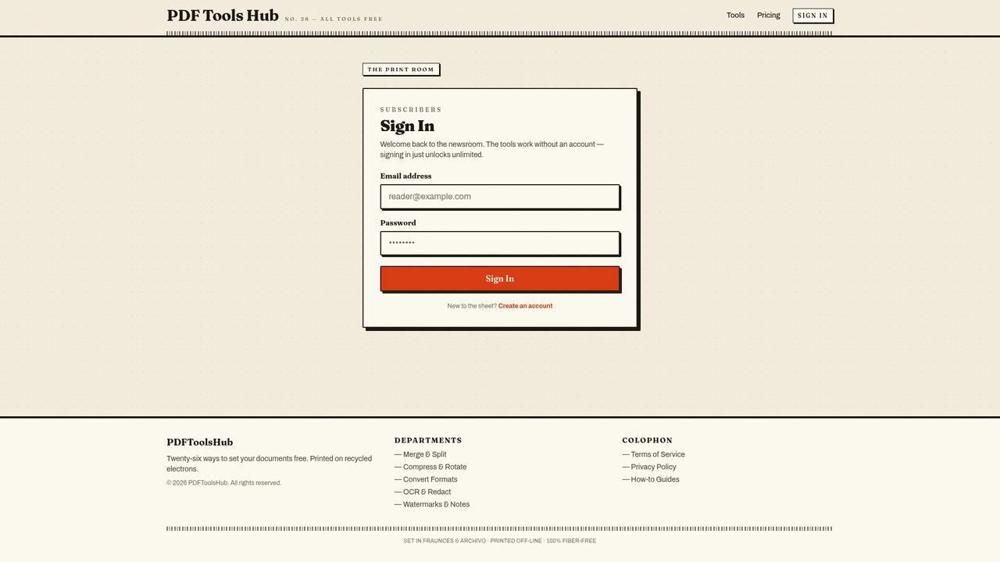
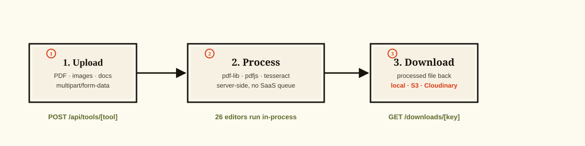
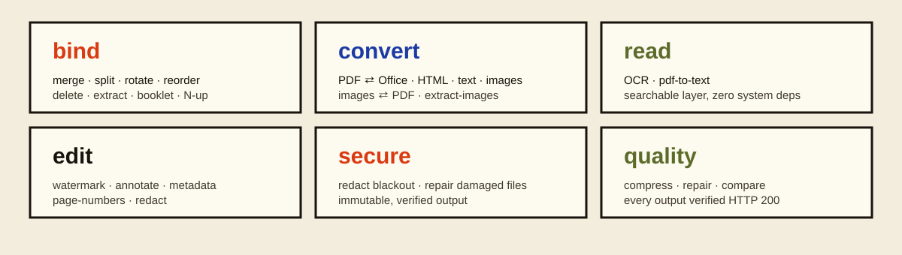

<p align="center">
  
</p>

<h1 align="center">PDFToolsHub</h1>
<p align="center"><em>The Magazine of PDF Utility</em></p>
<p align="center"><b>Twenty-six sharp-edged tools for the working press — merge, convert, manage, and publish PDFs from a single editorial workspace.</b></p>

<p align="center">
  
  
  
  
  
</p>

<p align="center"><code>hero</code> · <code>production</code> · <code>verified</code></p>

---

## Contents

- [📸 The Gallery — Live Snapshots](#-the-gallery--live-snapshots)
- [📰 The Paper](#-the-paper)
- [🎨 The Type](#-the-type)
- [🗂 The Press — 26 Tools](#-the-press--26-tools)
- [⚙️ The Machinery — Tech Stack](#️-the-machinery--tech-stack)
- [🚀 The First Edition — Quick Start](#-the-first-edition--quick-start)
- [🔌 The Edition Control — API](#-the-edition-control--api)
- [📋 The Fine Print — Configuration](#-the-fine-print--configuration)
- [🧱 The Archive — Project Structure](#-the-archive--project-structure)
- [✅ The Colophon — Scripts & Verification](#-the-colophon--scripts--verification)
- [©️ The Copyright Line — License](#️-the-copyright-line--license)

---

## 📸 The Gallery — Live Snapshots



**The landing page.** A newsprint saddle-stitch of tool cards — every utility one click away. The masthead carries the barcode rule, the paper grain is `#f3eddd`, and each card is a hard-offset `neo-card` with its signature `6px 6px 0` ink shadow.

<br clear="both">

| | | |
|---|---|---|
|  |  |  |

<p align="center"><em>Every tool ships its own workbench — upload, configure, process, download. Sign-in unlocks accounts, history, and API keys.</em></p>

---

## 📰 The Paper

**PDFToolsHub** is a production-grade, self-hostable web application that puts twenty-six
editorial-grade PDF utilities behind one clean, magazine-style interface. Every tool runs
entirely server-side — upload a file, receive a processed file. No external SaaS, no queue,
no hidden pipeline.

The interface follows a **Newsprint Magazine** editorial system:

- **New Serif Revival** (`Fraunces Variable`) for display — headlines, headings, mastheads.
- **Swiss Grotesque** (`Archivo Variable`) for body — forms, controls, tables.
- **Ink on bone paper** — `#f3eddd` paper, `#fdfaf0` cream, `#18140d` ink, `#d93a11` vermilion accent.
- **Neo-brutalist hard offsets** — the signature `neo-card` block with its `6px 6px 0` ink shadow.

The whole production-grade rebuild was validated live: **all 26 tools return valid output,
TypeScript compiles clean, the Jest suite passes, and the production build succeeds.**

---

### How it works



Three steps, no hidden pipeline. Files go in as `multipart/form-data`, each of the 26 editors
runs in-process (no Ghostscript, no GraphicsMagick, no external binaries), and the finished
file comes straight back.

- **1 · Upload** — one or many files (`multipart/form-data`)
- **2 · Process** — `pdf-lib`, `pdfjs-dist`, `tesseract.js`, `@napi-rs/canvas` run in-process
- **3 · Download** — stored locally, or persisted to S3 / Cloudinary

---

## 🎨 The Type

| Token | Value | Use |
|---|---|---|
| `paper` | `#f3eddd` | Page ground |
| `cream` | `#fdfaf0` | Card ground |
| `ink` | `#18140d` | Primary text, borders |
| `inksoft` | `#403a2c` | Secondary text |
| `phantom` | `#746b56` | Eyebrow labels, captions |
| `vermilion` | `#d93a11` | Accents, selection, badges |
| `cobalt` | `#1b3aa3` | Links, secondary accents |
| `olive` | `#5c6b2a` | Success, approval |
| `line` | `#221c12` | Hard borders |

**Typefaces** — Fraunces Variable (display) · Archivo Variable (body) · feature settings `ss01`, `cv05`.

---

## 🗂 The Press — 26 Tools



### Binding & Structure

| Tool | Endpoint | What it does |
|---|---|---|
| **Merge PDFs** | `merge` | Combine multiple PDFs into a single file |
| **Split PDF** | `split` | Extract individual pages into separate files |
| **Rotate PDF** | `rotate` | Rotate pages by 90° / 180° / 270° |
| **Reorder Pages** | `reorder` | Rearrange page order |
| **Delete Pages** | `delete-pages` | Remove a selected set of pages |
| **Extract Pages** | `extract-pages` | Pull a page range into a new file |
| **Booklet** | `booklet` | Impose pages for saddle-stitched booklet printing |
| **N-Up** | `n-up` | Place multiple pages per sheet |
| **Resize** | `resize` | Re-scale pages to a target size (e.g. A4) |
| **Flatten** | `flatten` | Flatten form fields & annotations into static ink |

### Conversion

| Tool | Endpoint | What it does |
|---|---|---|
| **PDF to Office** | `pdf-to-office` | Convert PDF → DOCX |
| **PDF to HTML** | `pdf-to-html` | Convert PDF → styled, self-contained HTML |
| **PDF to Text** | `pdf-to-text` | Extract the selectable text layer |
| **PDF to Images** | `pdf-to-images` | Export each page as JPG / PNG (ZIP) |
| **Images to PDF** | `images-to-pdf` | Combine PNG / JPG images into a PDF |
| **Extract Images** | `extract-images` | Pull embedded images out as a ZIP |

### The Reading Room (OCR)

| Tool | Endpoint | What it does |
|---|---|---|
| **OCR** | `ocr` | Add a searchable text layer to scanned PDFs |

### Editing & Security

| Tool | Endpoint | What it does |
|---|---|---|
| **Text Watermark** | `watermark-text` | Stamp a text watermark across pages |
| **Image Watermark** | `watermark-image` | Stamp an image / logo watermark |
| **Annotate** | `annotate` | Add textual annotations and highlights |
| **Metadata** | `metadata` | Set title, author, subject, keywords |
| **Page Numbers** | `page-numbers` | Add printed page numbers |
| **Redact** | `redact` | Black-out text terms or areas |
| **Compare** | `compare` | Diff two PDFs and output a report |

### Quality Control

| Tool | Endpoint | What it does |
|---|---|---|
| **Compress** | `compress` | Reduce file size via re-encoded streams |
| **Repair** | `repair` | Rebuild a damaged / truncated PDF |

> **Every tool above was verified live**: each endpoint returns HTTP 200 and a valid download
> (PDF magic bytes, ZIP archives, DOCX packages, HTML documents). The suite of tests,
> the type checker, and the production build are all green.

---

## ⚙️ The Machinery — Tech Stack

| Layer | Choice | Purpose |
|---|---|---|
| **Framework** | Next.js 15 · App Router | API routes + pages |
| **Language** | TypeScript (strict) | End-to-end type safety |
| **Styling** | Tailwind CSS 3.4 | The Newsprint system |
| **Fonts** | `@fontsource-variable/fraunces` · `@fontsource-variable/archivo` | Editorial type |
| **PDF core** | `pdf-lib` · `pdfjs-dist` · `@napi-rs/canvas` | Create, parse, render |
| **OCR** | `tesseract.js` | Searchable text layer |
| **Conversion** | `mammoth` · `docx` · `jszip` · `pako` | Office, HTML, images |
| **Auth** | `jsonwebtoken` · `bcrypt` | Cookie-based JWT sessions |
| **Rate limiting** | `rate-limiter-flexible` | Abuse control |
| **Storage** | AWS S3 / Cloudinary (optional) | Persisted downloads |
| **Database** | Prisma + PostgreSQL (optional) | User accounts & history |
| **Validation** | `zod` | Payload contracts |

Rendering (PDF → image) runs on **`@napi-rs/canvas`** — no system binaries such as
Ghostscript or GraphicsMagick required — which keeps the app **directly deployable on a VPS**.

---

## 🚀 The First Edition — Quick Start

### Prerequisites

- Node.js **18+**
- npm **9+**

### Installation

```bash
# 1. Clone & install
git clone https://github.com/NSKWeb/pdftoolshub.git
cd pdftoolshub
npm install

# 2. Configure environment
cp .env.example .env
```

### Minimal local run

```bash
npm run dev
# → http://localhost:3000
```

No database or external service is **required** to run the 26 tools locally — the app
falls back to on-disk storage. Configure a database and object storage only when you want
accounts, file history, and persisted downloads.

---

## 🔌 The Edition Control — API

### Authentication

| Method | Endpoint | Description |
|---|---|---|
| `POST` | `/api/auth/register` | Create a user account |
| `POST` | `/api/auth/login` | Log in and issue a session cookie |
| `POST` | `/api/auth/logout` | End the session |
| `GET` | `/api/auth/me` | Current user profile |

### Processing tools

| Method | Endpoint | Description |
|---|---|---|
| `POST` | `/api/tools/[tool]` | Run any of the 26 tools with `multipart/form-data` |

```bash
curl -F "files=@document.pdf" http://localhost:3000/api/tools/merge
# → { "message": "Processing complete", "downloadUrl": "/downloads/…", "filename": "merged.pdf" }
```

### Public API (API-key access)

| Method | Endpoint | Description |
|---|---|---|
| `POST` | `/api/public/process` | Run any tool with an API key (`x-api-key` header), rate-limited |

```bash
curl -X POST http://localhost:3000/api/public/process \
  -H "x-api-key: <your-key>" \
  -F "tool=compress" \
  -F "files=@document.pdf"
```

The public endpoint is rate-limited at **10 requests / minute per IP**.

### File delivery

| Method | Endpoint | Description |
|---|---|---|
| `GET` | `/downloads/[key]` | Download a processed file |

### Health

| Method | Endpoint | Description |
|---|---|---|
| `GET` | `/api/health` | Liveness probe — returns `200 OK` |

---

## 📋 The Fine Print — Configuration

| Variable | Required | Purpose |
|---|---|---|
| `JWT_SECRET` | for auth | Signs session tokens |
| `DATABASE_URL` | optional | Postgres connection for accounts & history |
| `AWS_ACCESS_KEY_ID`, `AWS_SECRET_ACCESS_KEY`, `AWS_REGION`, `AWS_S3_BUCKET` | optional | Persist processed files to S3 |
| `CLOUDINARY_CLOUD_NAME`, `CLOUDINARY_API_KEY`, `CLOUDINARY_API_SECRET` | optional | Persist processed files to Cloudinary |
| `PUBLIC_API_KEY` | for public API | Authenticates `/api/public/process` |
| `TESSERACT_DATA_DIR` | optional | Pre-seeded OCR language data (avoids first-run download) |

**Deployment — one VPS, everything included**

```bash
npm run build     # production build
npm run start     # serve on :3000
```

A complete step-by-step VPS guide (Ubuntu, systemd, nginx, HTTPS, Postgres) lives in
[`DEPLOY.md`](./DEPLOY.md). Ready-to-use systemd unit, nginx config, and a rebuild
script ship in [`deploy/`](./deploy/). CI (Typecheck → Tests → Build) runs on every
push via GitHub Actions — see [`.github/workflows/ci.yml`](./.github/workflows/ci.yml).

Recommended hosts: a single Linux VPS (any 1 GB box), Railway, Render, or Vercel.

---

## 🧱 The Archive — Project Structure

```
pdf-tools-hub/
├── src/
│   ├── app/
│   │   ├── api/
│   │   │   ├── auth/        # register · login · logout · me
│   │   │   ├── files/       # upload
│   │   │   ├── public/      # API-key endpoint
│   │   │   ├── tools/[tool]/# the 26-tool dispatch
│   │   │   ├── user/        # profile
│   │   │   └── health/      # liveness
│   │   ├── auth/            # sign in / sign up pages
│   │   ├── tools/[tool]/    # tool UI pages
│   │   ├── downloads/       # file delivery
│   │   ├── page.tsx         # landing page
│   │   ├── layout.tsx       # Newsprint shell
│   │   ├── globals.css      # design tokens & blocks
│   │   ├── error.tsx · loading.tsx · not-found.tsx
│   ├── components/          # React components (nav, upload, tool cards…)
│   ├── lib/                 # engine & infrastructure
│   │   ├── pdf-tools.ts     # the 26-tool dispatcher
│   │   ├── pdf-render.ts    # pdfjs + @napi-rs/canvas rendering
│   │   ├── ocr.ts           # tesseract.js worker
│   │   ├── annotate.ts / compress.ts / redact.ts / office.ts / html.ts / pdf-repair.ts
│   │   ├── rate-limit.ts    # rate limiting
│   │   ├── session.ts       # JWT cookies (bcrypt)
│   │   ├── storage.ts       # S3 / Cloudinary / local
│   │   ├── api-keys.ts      # public API keys
│   │   └── tools.ts         # tool registry (slug, name, description)
│   ├── middleware.ts        # route protection + security headers
│   └── types/               # shared types
├── prisma/                  # schema (accounts, files)
├── public/
│   ├── screenshots/         # README visuals (hero, pipeline, categories)
│   └── manifest.json · robots.txt
└── .env.example             # environment template
```

---

## ✅ The Colophon — Scripts & Verification

| Script | Description |
|---|---|
| `npm run dev` | Development server |
| `npm run build` | Production build |
| `npm run start` | Serve the production build |
| `npm run lint` | ESLint |
| `npm test` | Jest unit & component tests |
| `npm run prisma:generate` | Generate the Prisma client |
| `npm run prisma:migrate` | Run database migrations |

**Verification status (this rebuild):**

- ✅ `tsc --noEmit` — clean
- ✅ `npm test` — 9 / 9 passing
- ✅ `npm run build` — success
- ✅ Live smoke test — 26 / 26 tools return `HTTP 200` with valid output
- ✅ GitHub Actions — Typecheck · Test · Build green on every push

---

## ©️ The Copyright Line — License

MIT licensed — Copyright © 2026 NSKWeb. See [`LICENSE`](./LICENSE) for the full text.

For issues, questions, or contributions, please open an issue in this repository.